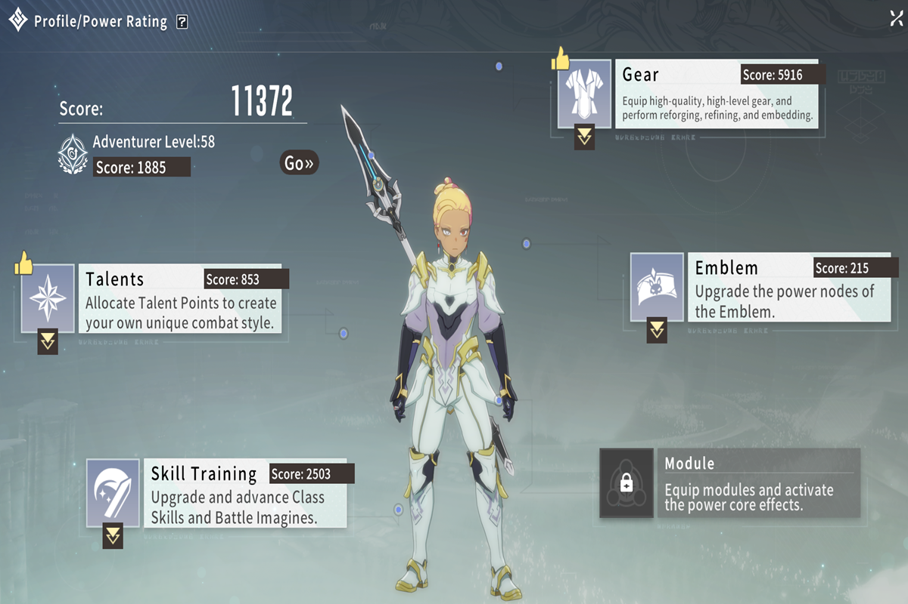

# Blue Protocol Gear Guide

<strong>📑 Table of Contents</strong>

- [📖 Introduction](#-introduction)  
- [📊 Ability Power](#-ability-power)  
  - [🌟 Talents](#-talents)  
  - [📘 Skill Training](#-skill-training)  
  - [⚔️ Gear](#-gear)  
  - [🔰 Emblem](#-emblem)  
  - [🔧 Module](#-module)  
- [🏰 Dungeons](#-dungeons)  
- [💡 Tips & Tricks](#-tips--tricks)  

---

<h2>📖 Introduction</h2>

Welcome to the **Blue Protocol Gear Guide**!  
This guide is designed to help you understand how to progress your character by increasing **Ability Power** and optimizing your equipment.  

You’ll learn:  
- The different systems that contribute to your **Ability Power**.  
- How to efficiently upgrade **Talents, Skills, Gear, Emblems, and Modules**.  
- Where to farm better gear in **Dungeons** and how loot works.  
- Practical **tips & tricks** to maximize your progression without wasting time or resources.  

Whether you’re just starting out or aiming for endgame optimization, this guide will walk you through the essentials step by step.  

[⬆️ Back to top](#blue-protocol-gear-guide)

<h2>📊 Ability Power</h2>

**Ability Power (AP)** is your overall measure of strength in **Blue Protocol**.  
It’s a combined score made up of multiple progression systems:  

- 🌟 **Talents**  
- 📘 **Skill Training**  
- ⚔️ **Gear**  
- 🔰 **Emblem**  
- 🔧 **Module**
 

  

    
💡 How To get to the Profile/Power Rating Screen

  To see this screen, press **C** and click on the **Ability Power** text.

  
 

### Why is Ability Power Important?

AP isn’t just a number — it directly determines what content you can access.  
- Each **dungeon** and **dungeon tier** has a **minimum AP requirement**.  
- If you don’t meet the threshold, you cannot enter that dungeon.  
- The higher your AP, the more challenging and rewarding content becomes.  

In short: **AP is the gateway to progression.**  
You raise your AP through these systems, unlock tougher dungeons, and in return those dungeons reward you with better gear to push your AP even higher.  

This creates the core loop of Blue Protocol:  
**Improve AP → Unlock Dungeons → Farm Gear → Get Stronger → Repeat.**  

We’ll dive into each AP component below, and later in the [🏰 Dungeons](#-dungeons) section we’ll cover how dungeon requirements tie into your progression path.  

[⬆️ Back to top](#blue-protocol-gear-guide)

<h3>🌟 Talents</h3>

Talents are one of the biggest contributors to Ability Power.  
- Unlocking and upgrading talents increases core stats and abilities.  
- Completing **Trails** grants more points to expand your talent tree.  

👉 Always prioritize talents that boost your class’s main attributes.  

---

<h3>📘 Skill Training</h3>

Skill Training enhances your combat abilities:  
- Upgrading **skills** increases their power and effectiveness.  
- Try to **maximize points** to unlock stronger abilities.  

👉 Don’t forget to revisit older skills — even basic ones scale well when upgraded.  

---

<h3>⚔️ Gear</h3>

Gear progression has the largest direct impact on Ability Power.  

#### Equipment Tiers

For equipment, these are the three main categories you should know:

- **Purple** has two different tiers:  
  - *Entry Level* → provides Reforge up to **30%**  
  - *Superior* → provides Reforge up to **80%**

- **Gold** → leads you to **100%**

We all want Gold, but if that’s not achievable aim for Superior.

**Sources for gear tiers:**
- **Unstable / Gear Shop** = Entry  
- **Normal Dungeons** = Superior  
- **Chaotic Dungeons** = Gold  

---

<h3>🔰 Emblem</h3>

Emblems add passive bonuses that contribute to Ability Power.  
- Equipping stronger emblems boosts your stats.  
- Some emblems have **set effects** when used together.  

👉 Experiment with different emblem setups depending on class role (DPS, Support, Tank).  

---

<h3>🔧 Module</h3>

Modules are late-game progression systems that enhance gear and abilities.  
- Attach modules to gear for additional stat customization.  
- Higher-rarity modules provide unique effects.  

👉 Prioritize farming modules that synergize with your build/playstyle.  

[⬆️ Back to top](#blue-protocol-gear-guide)

---

<h2>🏰 Dungeons</h2>

Dungeons are the main source of higher-tier equipment.  

- **Unstable / Gear Shop** → Entry-level gear  
- **Normal Dungeons** → Superior gear  
- **Chaotic Dungeons** → Gold gear  

You also get a **first-time clear bonus** that guarantees a reward box.  
- These boxes let you choose between specific dungeon drops.  
- Example: *Goblin dungeon offers Earrings and (possibly) Arms.*  
- Open the box as your **preferred class** to maximize stat alignment.  

⚠️ Be aware: stats are random, and you may still roll suboptimal attributes even for your class.  

[⬆️ Back to top](#blue-protocol-gear-guide)

---

<h2>💡 Tips & Tricks</h2>

- Aim for **Superior** gear if **Gold** is not achievable early.  
- Don’t rely solely on **first-time clear boxes** for perfect stats — they can still roll poorly.  
- Always invest in **Talents + Skills** alongside gear upgrades for balanced growth.  
- Track upcoming updates (e.g., new categories like Sept 9th) to stay ahead of progression.  

[⬆️ Back to top](#blue-protocol-gear-guide)

